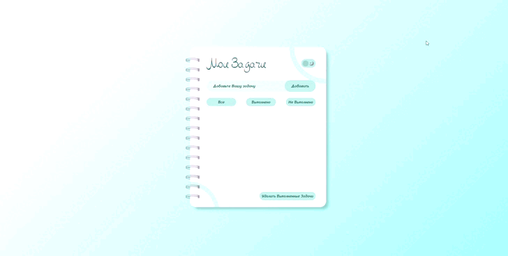
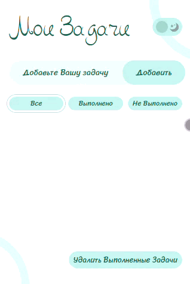

<h1>Мои задачи</h1> 
Js project

<h2>🛠️ Use Skills:</h2>  

---

[Demo Link  ](kuloverovaolga.github.io/todo/)

<h2>💁 Info:</h2> 

Этот задачник создан в соответствии с макетом, разработанным самостоятельно в Figma. В нем предусмотрена возможность
удаления, редактирования, фильтрации и перемещения задач (с функцией Drag and Drop). Реализованы светлая и темная темы.
Данные добавляются в LocalStorage для сохранения информации между сессиями. Страница также адаптирована для удобного
отображения на мобильных устройствах и планшетах. Пройдена валидация HTML и CSS.
                                            

---

---

<h2>📱 My contacts:</h2> 
<ul>
 <li>Email: <a href="mailto:kuloverova.olga@mail.ru">📧 kuloverova.olga@mail.ru</a></li>
 <li>Telegram:  <a href="https://t.me/kuloverova_olga">💬 @kuloverova_olga</a></li>
 <li>Website:  <a href="http://olgakuloverova.ru/">💻 olgakuloverova.ru</a></li>

</ul>